---lab
date: 2025-11-9
author: DJZ
category: Unity引擎
tags: Unity VR 虚拟现实
---

# Unity引擎基础教程

## 1 关于Unity引擎
    Unity 引擎作为全球广泛应用的游戏开发核心架构。它凭借强大的兼容性与灵活的开发能力，不仅是海量热门游戏的 “诞生基石”，更能轻松驾驭 3D、2D 项目开发，
    同时深度覆盖 VR（虚拟现实）、AR（增强现实）、MR（混合现实）及数字孪生等多元领域。

    Unity直通车，这里面的三节课，可以初步了解Unity,从下载安装到使用
    基础课程网址：https://rbbhr.xetsl.com/s/4u4YW0
    基础课程全课程解锁密码：ht888888

## 2 安装Unity Hub以及编辑器

### 2.1 Unity Hub
开发Unity项目的软件

下载网址：https://unity.cn/releases

点击“下载Unity Hub”-“Windows下载”并安装

### 2.2 编辑器
Unity Hub里的配件，有各种版本，**建议下载长期支持版本（比较稳定）**

年份建议下载2021年之后的。我一直在用的是**2022.3.53f1c1**版本

下载方式可以直接点击“从Unity Hub下载”

下载模块弹出后，会自动勾选两个下载内容“Visual Studio 2022”（此软件为开发过程中C#语言的编辑器）与“文档”

除此之外还要手动勾选开发平台所需插件

手机、平板、VR设备开发（就是项目最终在这些设备上运行），勾选“Android Build Support”插件

电脑设备运行，勾选“Windows Build Support (lL2CPP)”与“Windows Dedicated Server Build Support”插件

最后勾选“简体中文”语言包，点击“继续”即可

## 3 创建Unity项目

### 3.1 打开Unity Hub

首先注册账号登录，并申请个人许可证。

### 3.2 点击右侧蓝色“新项目”

弹出以下界面

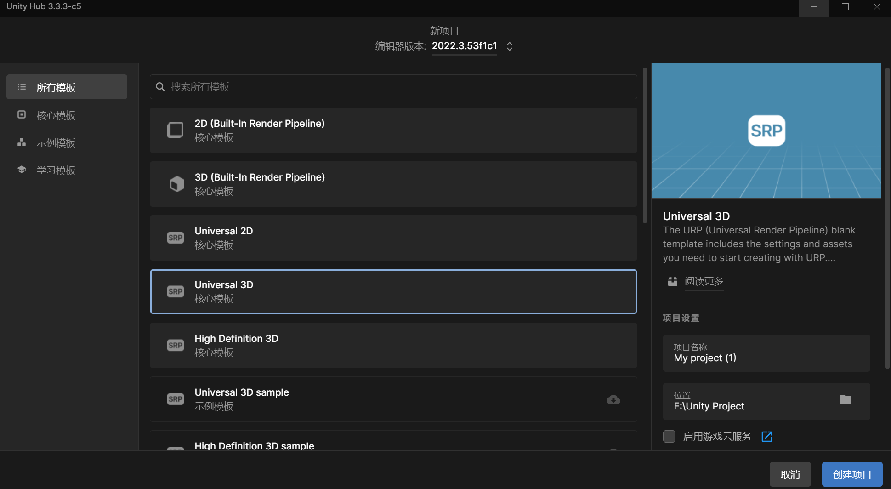

### 3.3 新建项目界面介绍
  
  最上方可以选择编辑器版本
  
  Unity提供了许多模板，主要分为**核心模板**（开发项目所用的基础模板），**示例模板**（此模板中包含Unity官方的 Demo），以及**学习模板**（感兴趣的可以看看）
  
  我们开发项目主要用核心模板，并且都是基于3D模板开发的
  
  其中3D模板又包括**3D (Built-In Render Pipeline)**（最基本的3D模板）
  
  **Universal 3D**（基于URP管线渲染的3D模板，适用于中型项目的开发，**用此模板开发项目足够**）

  
 
  **High Definition 3D**（基于HDRP管线渲染的3D模板，适用于大型项目开发）
  
### 3.4 新建项目
1.选择编辑器版本

2.选择URP模板

3.设置好项目名称以及位置

4.创建项目

## 4 Unity项目的研发

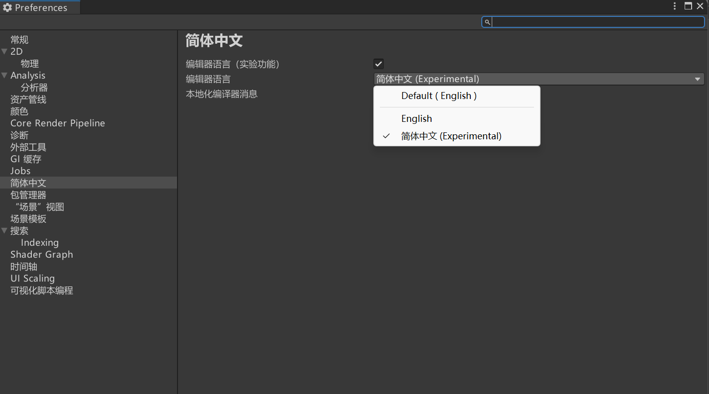

首先菜单栏汉化问题（英语很好的话，可以略过(￣▽￣)~*）。正常情况下“编辑-首选项-简体中文”是可以直接设置的

如果没有这个语言选择的这栏，可能是Unity Hub版本较低，可以下载一个新版的

或者自己打汉化补丁，可以看这个B站Up主的

【unity没有语言设置选项怎么处理】https://www.bilibili.com/video/BV1bM4y1e7uc?vd_source=e9dbe2175df64fbf922aacff60af1bfe

### 4.1 项目界面介绍

上图界面是我一直用的结构

左上“**场景**”为开发视图，我们可以在这个界面进行各种物体搭建，测试

左下“**游戏**”为玩家视图，项目打包后，玩家看到的效果

“**层级**”列，我们可以在这列为当前场景添加物体等，是主要编辑区域

“**项目**”部分为整个项目所用的资源，从外部导入资源也是首先导进这个区域，包括包、UI图片、贴图、视频、音频、模型、动画、脚本、场景等资源

最右侧“**检查器**”是对单个物体的参数进行编辑、查看用的，在此处可以看到当前物体下的各种组件，之后会详细描述

### 4.2 项目研发前准备工作

首先，**在Sences文件夹下创建一个新的场景**，不要再默认的SampleScene场景里开发项目，

之后自己导入其他资源的时候，容易把这个场景顶掉，

连回收站里都有没有，不要后悔莫及（来自一位学姐的惨痛经验）

然后，建如下**图片、材质、模型、脚本、音频&视频**几个文件夹，这几个都是常用的资源分类，方便管理

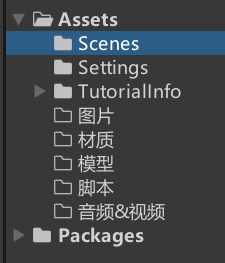

## 附录

### 附录一：一些好用的网站

**1.Unity官网素材网**

Unity官网上还是有一些免费好用的资源的，各种类型资源都有，可以挖掘一下

网址：https://assetstore.unity.com/

除了直接进网址之外，也可以在项目菜单点击“窗口-资源商店”进行跳转

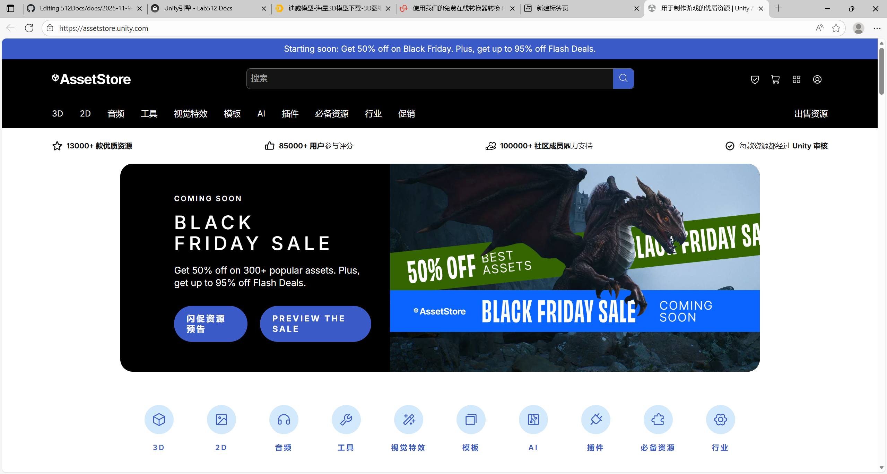

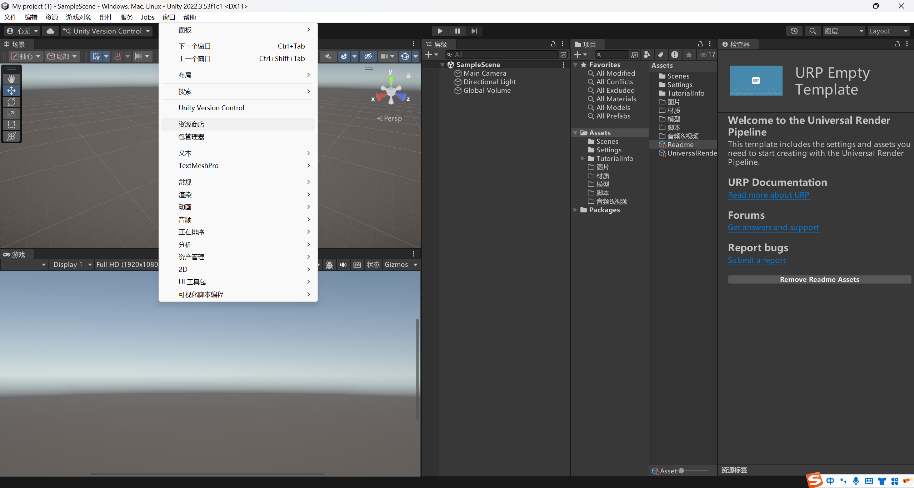

**2.迪威模型**

网址：https://www.3dwhere.com/

迪威模型网中有大量的机械工业设备建模，类型非常多，大部分都是SolidWorks能打开的，每个账号每天有三次免费下载次数

**3.fabconvert**

网址：https://fabconvert.com/cn/convert/fbx#google_vignette

Unity中所用的模型均为.fbx格式,因此需要进行格式转换，此网站最大支持100mb文件转换，并且支持批量转换，完全免费，还是很方便的

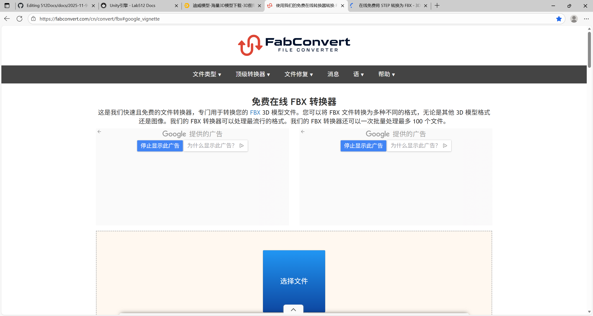

除此之外，上方的**迪威模型**，以及https://www.3dpea.com/cn/convert/STEP-to-FBX、

https://www.freesound.cn/search/word-%E8%88%92%E7%BC%93

这些网站也可以进行格式转换

**4.Mixamo**

网址：https://www.mixamo.com/#/

首先需要注册登录，此网站用于绑定人类模型动作，填入模型后，设定好好关节，可以直接将想要的动作绑到人物上，还是很方便的

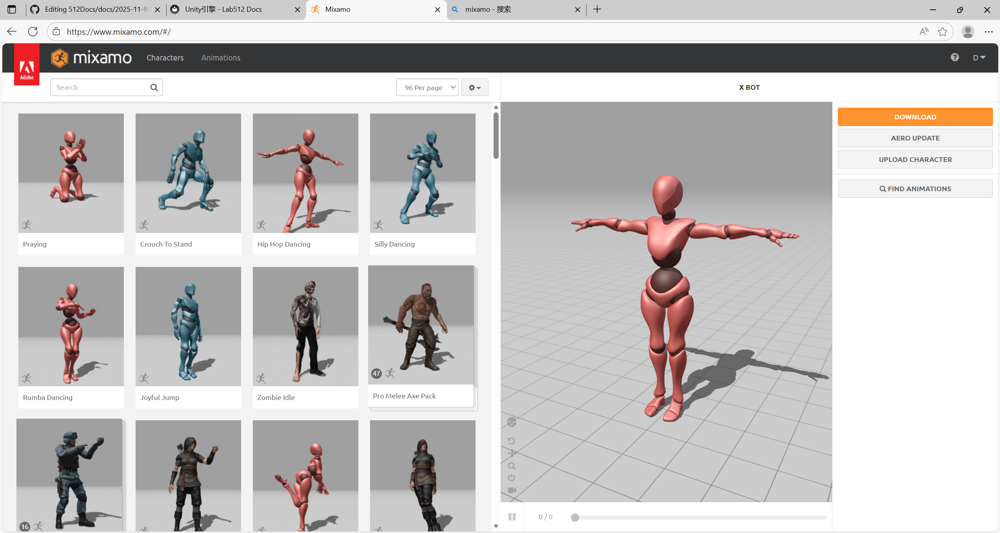

配置步骤：

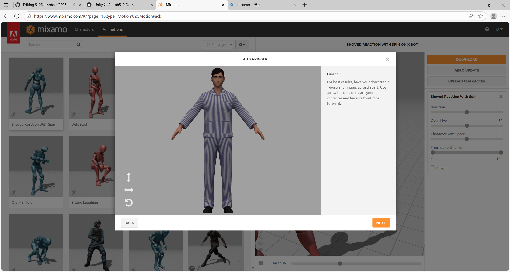

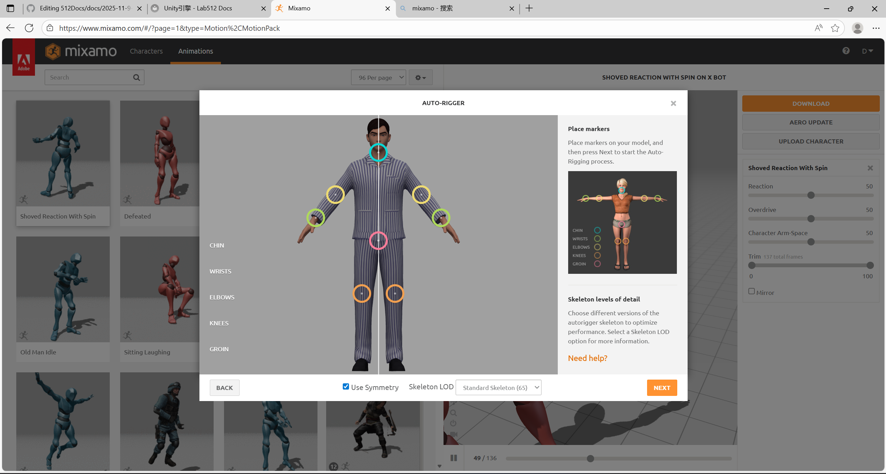

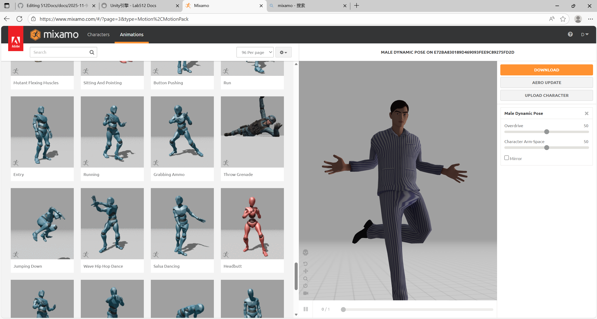

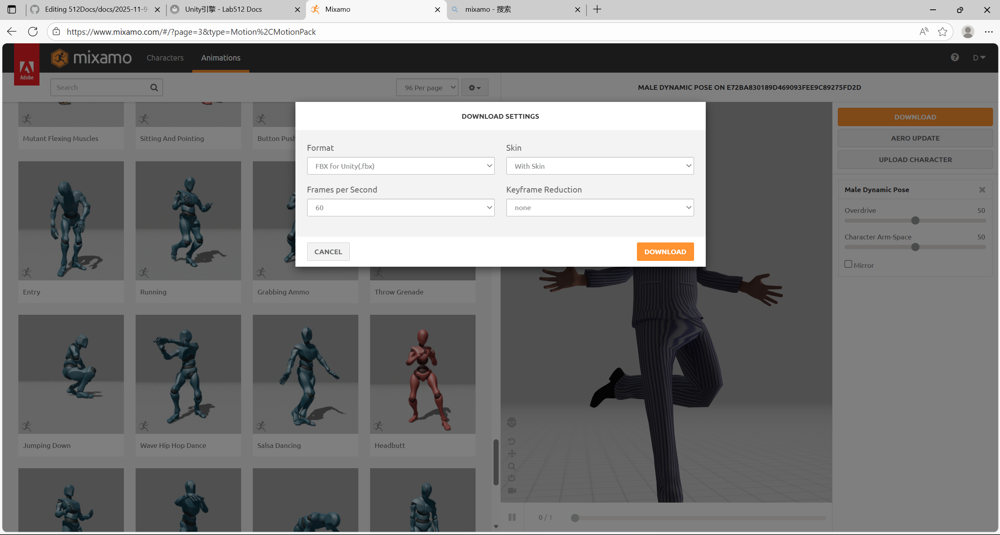

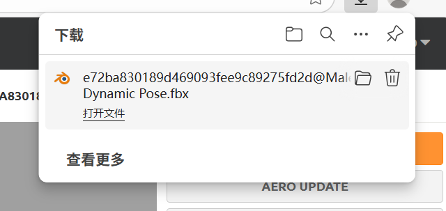

最终得到.fbx动画文件，直接导入Unity即可

**5.一些音效素材网站**

网址：

https://mixkit.co/free-sound-effects/

https://www.freesound.cn/search/word-%E8%88%92%E7%BC%93

https://sc.chinaz.com/yinxiao/250219001280.htm

**6.实验空间————国家虚拟仿真实验教学课程共享平台**

网址:https://www.ilab-x.com/

此网站可用于思路拓展，都是用Unity制作的实验课程，各个专业，行业的都有

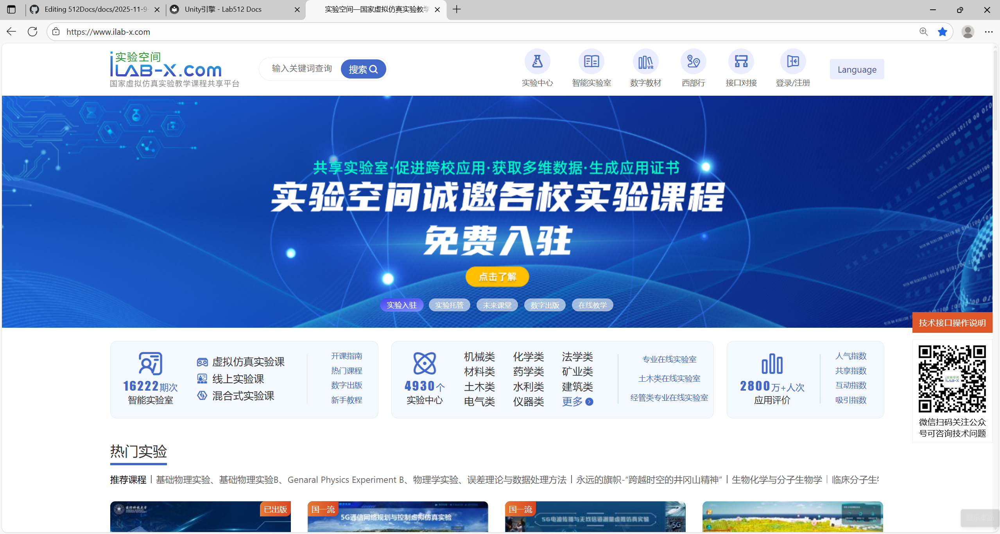

**7.爱给网**

网址：https://www.aigei.com/

爱给网资源很丰富，建模、贴图、音效等资源有很多

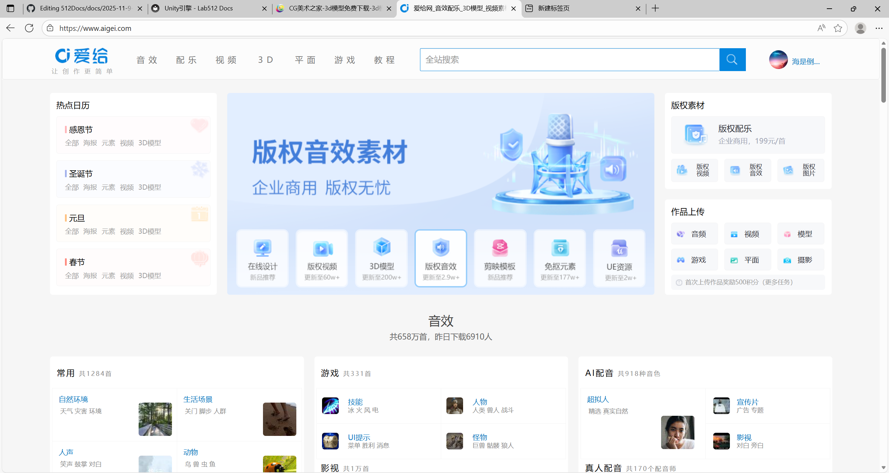

**8.CG美术之家**

网址：https://www.cgmszj.com/

此网站更多的是人物游戏类模型，质量很高，但是大部分为付费资源，而且文件格式大部分不能直接导入Unity

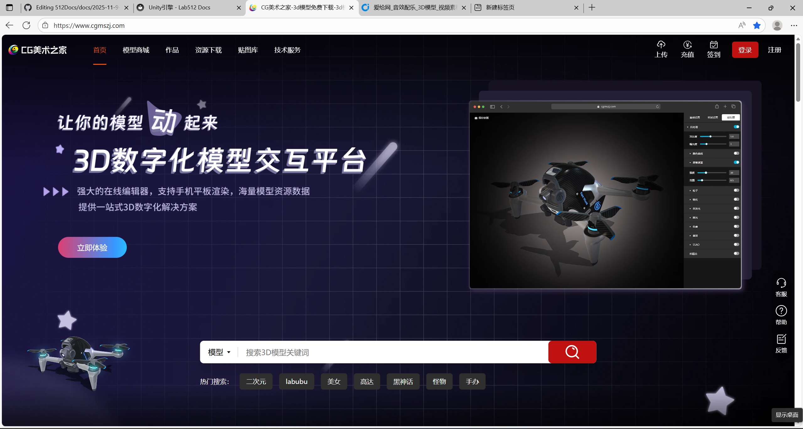

**9.其他资源**

这两篇知乎帖子也提供了许多资源链接

网址：

https://zhuanlan.zhihu.com/p/360452175

https://zhuanlan.zhihu.com/p/564846411

### 附录二：一些学习资源

**1.B站Up主：大自然卫士**

【Unity 流水线教学 零基础到精通 课程介绍】https://www.bilibili.com/video/BV1xJ4m137AG?vd_source=e9dbe2175df64fbf922aacff60af1bfe

此up主，提供了基础机械臂控制（怎样让机械臂具有物理效果运行），以及机械臂、传送带、上料、放货等基本流水线环节的联动

还有进阶的机械臂物理效果，采用IK组件

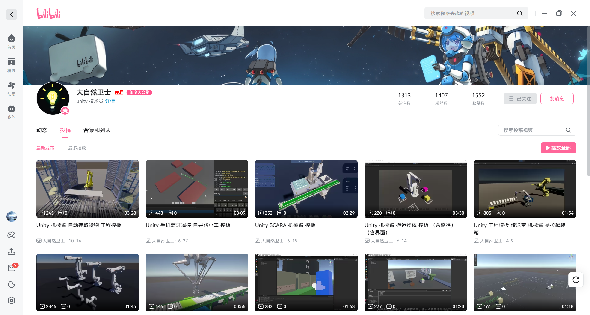

**2.B站Up主：阴沉的怪咖**

【Unity+DeepSeek | 使用DeepSeek驱动AI二次元小姐姐】https://www.bilibili.com/video/BV1ZoNee8EJB?vd_source=e9dbe2175df64fbf922aacff60af1bfe

此Up主做出了大量的AI大模型接入Unity案例，各种各样国内外的、在线、离线的大模型，都做出了Demo

我只实现过接入Deepseek，并采用百度智能云进行TTS/STT的Demo，可以尝试一些其他的Demo

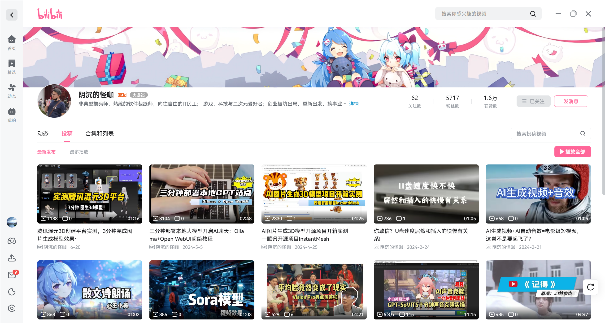
