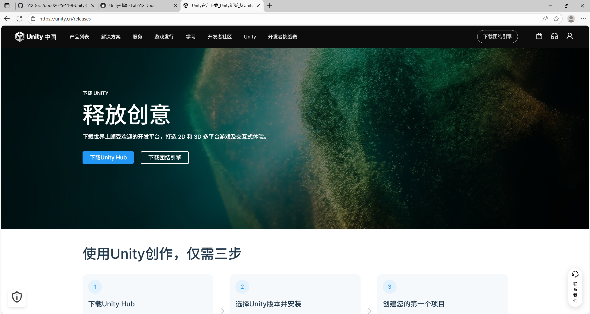
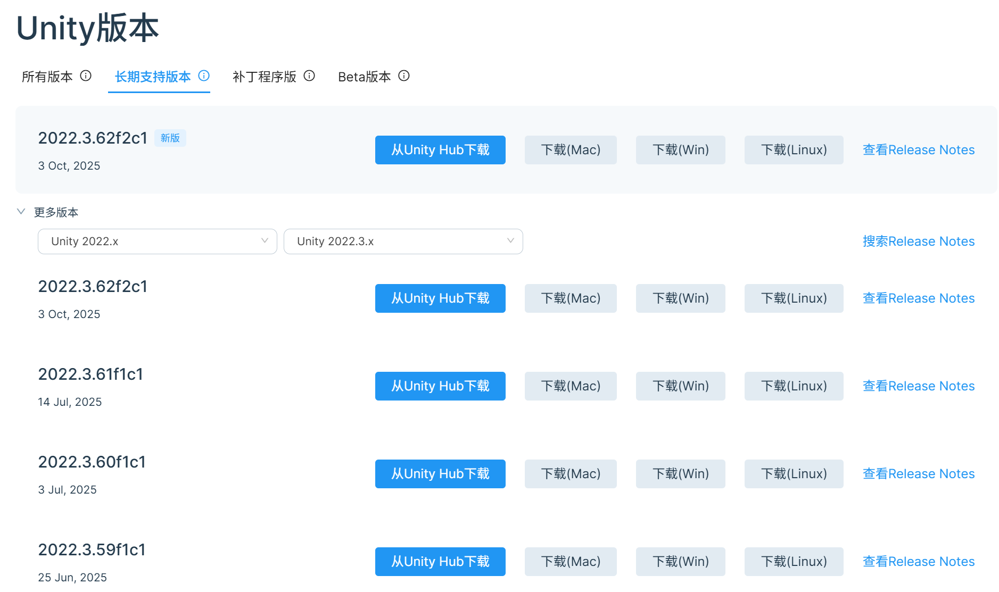
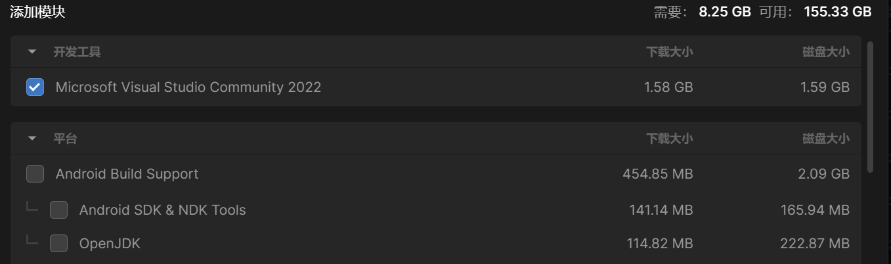
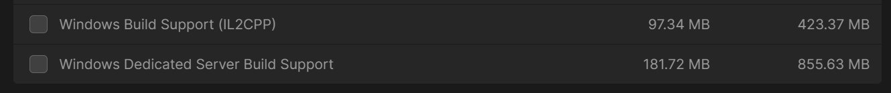
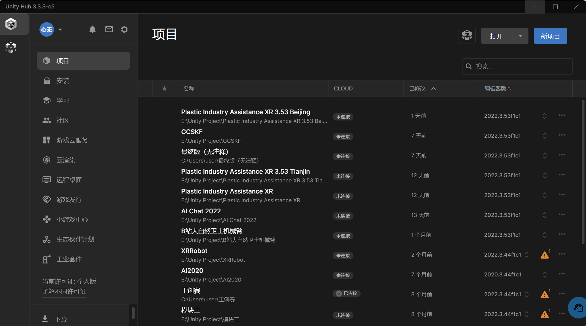
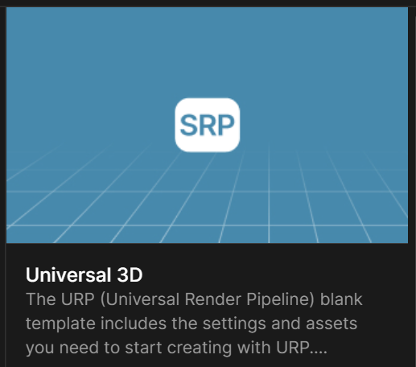

<strong>📅 发布日期:</strong> 2025-11-09 &nbsp;|&nbsp;
<strong>👤 作者:</strong> DJZ &nbsp;|&nbsp;
<strong>📁 分类:</strong> Unity引擎 &nbsp;|&nbsp;
<strong>🏷️ 标签:</strong> Unity,VR,虚拟现实

# Unity引擎基础教程

## 1 关于Unity引擎
    Unity 引擎作为全球广泛应用的游戏开发核心架构。它凭借强大的兼容性与灵活的开发能力，不仅是海量热门游戏的 “诞生基石”，更能轻松驾驭 3D、2D 项目开发，
    同时深度覆盖 VR（虚拟现实）、AR（增强现实）、MR（混合现实）及数字孪生等多元领域。

    Unity直通车，这里面的三节课，可以初步了解Unity,从下载安装到使用
    基础课程网址：https://rbbhr.xetsl.com/s/4u4YW0
    基础课程全课程解锁密码：ht888888

## 2 安装Unity Hub以及编辑器

### 2.1Unity Hub
开发Unity项目的软件

下载网址：https://unity.cn/releases

点击“下载Unity Hub”-“Windows下载”并安装

### 2.2编辑器
Unity Hub里的配件，有各种版本，**建议下载长期支持版本（比较稳定）**

年份建议下载2021年之后的。我一直在用的是**2022.3.53f1c1**版本

下载方式可以直接点击“从Unity Hub下载”

下载模块弹出后，会自动勾选两个下载内容“Visual Studio 2022”（此软件为开发过程中C#语言的编辑器）与“文档”

除此之外还要手动勾选开发平台所需插件

手机、平板、VR设备开发（就是项目最终在这些设备上运行），勾选“Android Build Support”插件

电脑设备运行，勾选“Windows Build Support (lL2CPP)”与“Windows Dedicated Server Build Support”插件

最后勾选“简体中文”语言包，点击“继续”即可

## 3 创建Unity项目

### 3.1 打开Unity Hub，首先注册账号登录，并申请个人许可证。

### 3.2 点击右侧蓝色“新项目”，弹出以下界面

### 3.3 新建项目界面介绍
  最上方可以选择编辑器版本
  
  Unity提供了许多模板，主要分为**核心模板**（开发项目所用的基础模板），**示例模板**（此模板中包含Unity官方的 Demo），以及**学习模板**（感兴趣的可以看看）
  
  我们开发项目主要用核心模板，并且都是基于3D模板开发的
  
  其中3D模板又包括**3D (Built-In Render Pipeline)**（最基本的3D模板）
  
  **Universal 3D**（基于URP管线渲染的3D模板，适用于中型项目的开发，**用此模板开发项目足够**）

  
 
  **High Definition 3D**（基于HDRP管线渲染的3D模板，适用于大型项目开发）
  
### 3.4 新建项目
1.选择编辑器版本

2.选择URP模板

3.设置好项目名称以及位置

4.创建项目
